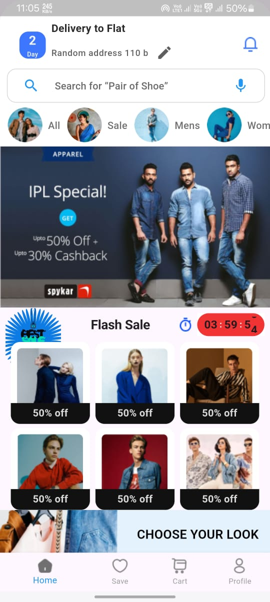
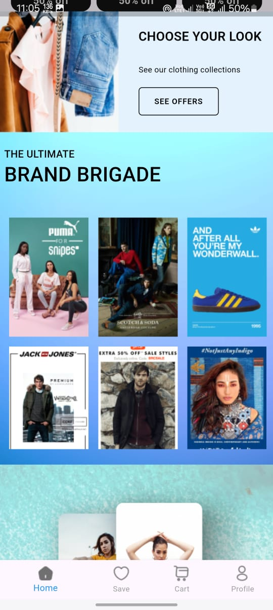
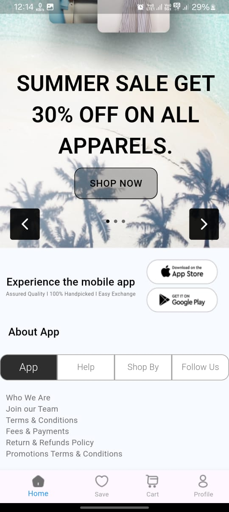

# Clothing Trial App

A Flutter project for experimenting with clothing store app UI and functionalities.

## App Design

Below is a preview of the app design:

<p float="left">
  
   
  
  
</p>

## App Overview

The **Clothing Trial App** is designed to showcase categories of clothing (e.g., Men's, Women's, Kids) with integrated features such as search, animated interactions, and dynamic UI components. This app is a starting point for building a full-fledged clothing store application in Flutter.

## Features

- Tappable categories like 'All,' 'Sale,' 'Mens,' 'Women,' and 'Kids.'
- Functional search bar with microphone and search icons.
- Integration of Lottie animations for a rich user experience.
- Scrollable category row with image icons and discount banners.

## Getting Started

To run this app, clone the repository and ensure you have Flutter installed on your machine. You can follow the instructions below:

1. Clone this repository:
    ```bash
    git clone https://github.com/yourusername/clothing_trial.git
    ```

2. Navigate to the project directory:
    ```bash
    cd clothing_trial
    ```

3. Get the dependencies:
    ```bash
    flutter pub get
    ```

4. Run the app:
    ```bash
    flutter run
    ```

## Resources

A few resources to help you get started with Flutter development:

- [Lab: Write your first Flutter app](https://docs.flutter.dev/get-started/codelab)
- [Cookbook: Useful Flutter samples](https://docs.flutter.dev/cookbook)

For more help, view the official Flutter [documentation](https://docs.flutter.dev/), which offers tutorials, samples, and guidance on mobile development.
